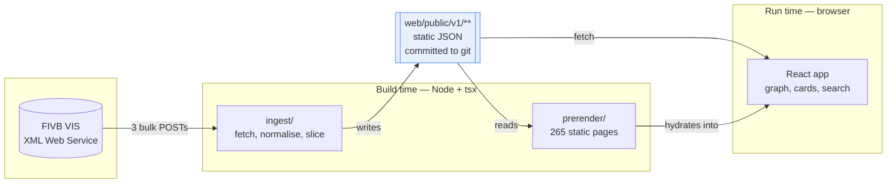
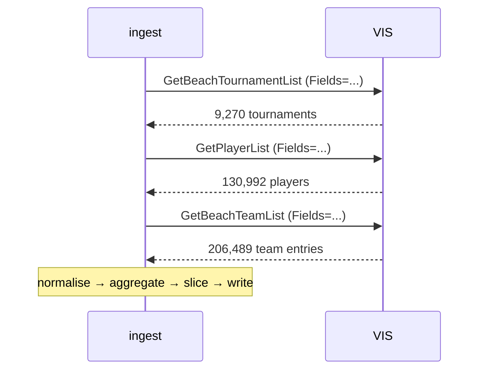
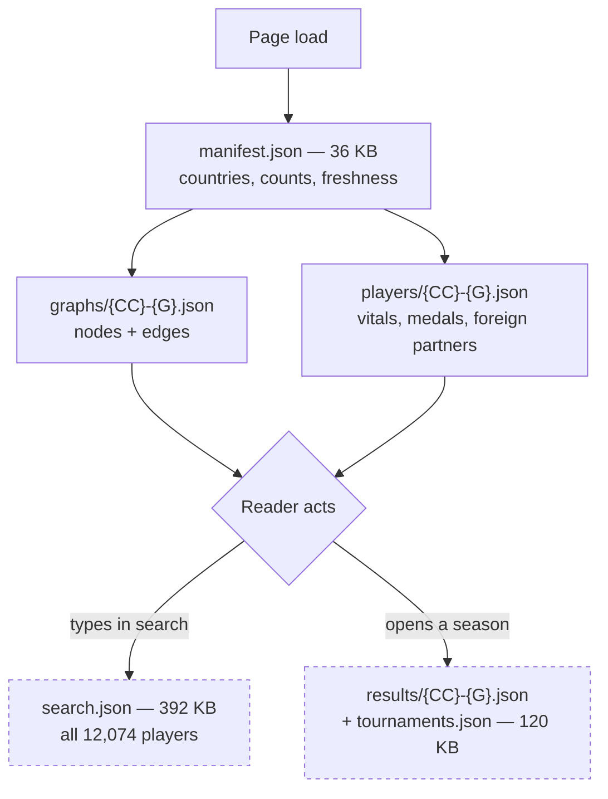
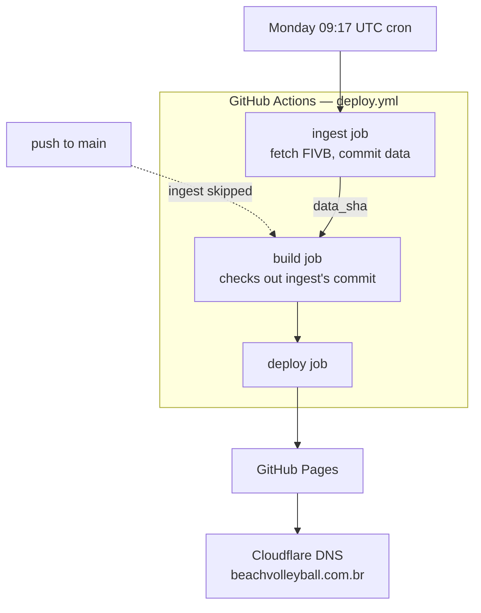

# Architecture

How the system is shaped, and the reasoning behind each major choice. For what
individual modules do see [implementation.md](implementation.md); for the
published data see [data-model.md](data-model.md).

---

## The shape

Two programs and a contract between them.

The contract is `web/public/v1/`. Everything upstream of it is a build-time
concern; everything downstream is a browser concern. They share exactly one
source file — `web/src/schema.ts` — so the two cannot drift.

## Why static

There is no server, no database, no API of ours. The whole dataset is 12 MB of
JSON on a CDN.

This follows from the data's shape rather than from minimalism for its own
sake. The archive changes **once a week**, is **fully public**, and is **small
enough to ship whole**. A database would add an availability dependency, an
operational surface and a cost, in exchange for freshness the data does not
have and query flexibility the site does not need. A static tree is free to
host, has no attack surface worth the name, cannot be "down" independently of
the CDN, and — because it is committed to git — survives FIVB disappearing.

The trade accepted: no arbitrary queries, and any new view needs its shape
computed at build time. That has been the right trade five features running.

## Why the data is committed to git

`web/public/v1/` is tracked, not gitignored. This is the single most
consequential decision in the project.

The alternative — regenerate every run, publish as a CI artifact — was the
original design, and it failed on three counts:

1. **FIVB is a single point of failure.** A free third-party service with no
   uptime guarantee could take the whole site down.
2. **Code changes were coupled to data fetches.** A CSS fix could not deploy
   without a successful FIVB fetch it did not need.
3. **No history.** There was no record of what the archive looked like last
   month.

Committing it fixes all three: a fresh clone builds immediately, code pushes
skip the ingest entirely, and the commit log becomes a changelog of the archive
over time — which is how a player's federation change was caught in the act.

It also raises the bar for what the ingest may write. Output is pretty-printed
(readable diffs), sorted by immutable keys (stable diffs — sorting by a mutable
field would make one player's extra tournament reorder a whole file), and
guarded by `regression.ts`, which refuses to commit a rebuild that looks like a
broken fetch rather than a real change.

## Why three bulk requests and no fan-out

The entire FIVB archive is reachable in three list calls — tournaments,
players, team entries — totalling ~36 MB and about 15 seconds.

No per-tournament fan-out means no rate-limit pacing, no incremental cache to
go stale, and a rebuild that is **self-healing**: any ingest bug or upstream
correction is washed out by the next run, because nothing is carried forward.

This property has been defended twice under pressure — once when a
just-finished tournament's placements were missing and a per-tournament ranking
call would have filled the gap. The gap closed on its own within a day; the
architecture stayed intact. That call is revisitable (quirks §17 records
exactly how), but it should be made deliberately.

**Always send a `Fields` list.** Default VIS responses return every attribute
and are several times larger — and, as quirks §17 records the hard way, some
requests return a silently empty element without one.

## Why country × gender slices

The graph is sliced into 264 files rather than served whole.

A single global graph would be 12,074 nodes — unreadable as a visualisation and
a large download to answer a question that is almost always about one country.
Slicing gives each page a payload proportional to what it shows.

The cost is real and is the project's most-discussed trade-off: **an edge
requires both endpoints in the same slice**, so a cross-federation partnership
appears in neither country's graph. That is ~1% of partnerships, but
concentrated — a player who transfers loses their whole history at once. The
resolution was not to change the slicing but to carry those partnerships on the
*player* instead, as the card's *Other federations* section.

## Load strategy

Not all of the 12 MB is equal. Files are tiered by how likely a visit is to
need them.

Solid edges load with the page; dashed ones are fetched on first interaction
and never otherwise. The two lazy tiers exist because they are the two largest
things published and most visits need neither: `results/` is 2.9 MB across all
slices (127,899 rows), `search.json` is 392 KB.

`api.ts` memoises every fetch by URL, so switching country and back, or opening
a second season, costs nothing.

## Rendering: React owns structure, the simulation owns position

The graph is SVG, not canvas. React renders one `<line>` per partnership and
one `<g>` per player, then **never re-renders during simulation** — the
d3-force tick writes `x`/`y` straight to the DOM through refs.

Re-rendering ~1,500 elements at 60fps through React drops frames on the larger
countries. Selection and hover only toggle CSS classes, which is cheap enough
to go through React normally.

SVG over canvas because the nodes need to be real, hit-testable, focusable
elements for keyboard and screen-reader users — and because the accessible
twin (the table below the graph) shares the same data rather than being a
second implementation.

## Prerendering

`ingest/prerender.ts` writes one static HTML document per slice — 265 pages
including the home page — each containing the actual player table, per-page
metadata and JSON-LD. React replaces the markup on mount.

This is not a second implementation to maintain: it is the same committed JSON,
rendered once at build time, for readers who do not run JavaScript (crawlers,
link previews, text browsers). It also produces `sitemap.xml`, `robots.txt` and
`llms.txt`.

`/about/` is the exception — a standalone document that deliberately ships
*without* the module script, because booting the app on a path matching no
slice would fall back to the default country and replace the page.

## Deployment

Three jobs in a strict pipeline. Two details matter:

- **`build` checks out the exact commit `ingest` produced**, not the ref the run
  started on, because the ingest's push landed after that.
- **`ingest` is a separate job** so that a failure downstream can be retried
  with "re-run failed jobs" without re-fetching from FIVB — GitHub preserves a
  successful job's outputs across a partial re-run.

Failure semantics: if the ingest fails — including refusing to publish a
suspicious rebuild — nothing downstream runs and the site keeps serving last
week's data. Degraded to *slightly stale*, never to *down*.

**Origin coupling.** Canonical URLs are built as `SITE_URL + BASE_PATH + page`,
so the two must describe the same place. A project Pages site lives at
`owner.github.io/repo/`; a custom domain moves it to the root. Setting one
without the other publishes hundreds of canonical tags pointing at a path that
exists nowhere. `.github/actions/site-origin` derives both from a single
`SITE_URL` variable, so **the broken combination is not expressible**. CI uses
the same action, so a pull request builds at the same base as the deploy.

`deploy-cloudflare.yml` is a complete alternative targeting Cloudflare Pages.
It has **no automatic gate** against `deploy.yml` — disable one by hand.

## Stack

| | | Why this |
|---|---|---|
| **TypeScript** 5 | everything | One `schema.ts` shared by ingest and app is what stops the contract drifting. Strict mode. |
| **React** 18 | app | Component model for the card/controls/table; the graph opts out of it where it costs frames. |
| **Vite** 6 | build, dev | Fast dev server, and `BASE_URL` handling that makes the base-path switch a config change. |
| **d3-force** 3 | layout only | Just the simulation — not `d3-selection`, not `d3-scale`. Rendering stays ours. |
| **tsx** | ingest runner | Runs the TypeScript ingest directly; no separate build step for build-time code. |
| **Vitest** 2 | unit tests | 467 tests. Same transform pipeline as Vite, no second config to keep in step. |
| **Playwright** 1.62 | browser tests | 113 tests against `vite preview` of the real `dist/`, cross-checked against the published JSON. |
| **ESLint** 9 | lint | Flat config, with the React Hooks rules. |
| **stylelint** 17 | CSS lint | The errors-only preset. The one check that reads CSS at all — see the note under "No CSS framework". |

**Runtime dependencies are three packages**: `react`, `react-dom`, `d3-force`.
214 KB of JavaScript, 71 KB gzipped.

Deliberately not used:

- **No router.** Slices are real prerendered paths; the app reads
  `location.pathname` and writes with `history.replaceState`. A router would add
  a dependency to reimplement what the static files already provide.
- **No state manager.** The state is a country, a gender, a selection and a
  threshold. `useState` in `App.tsx` is enough, and prop-drilling keeps the
  data flow legible.
- **No CSS framework.** Plain CSS with custom properties for theming; each
  component has a sibling stylesheet. The whole site is 28 KB of CSS, linted by
  `stylelint` — `tsc` and `vite build` both parse a stylesheet with a dropped
  closing brace without complaint, so nothing else would catch one.
- **No data-fetching library.** Six `fetch` calls behind a memoising map.
- **No charting library.** The graph is bespoke SVG; a general library would be
  larger than the whole app.
- **No XML parser.** VIS responses are flat, attribute-only elements; a general
  parser builds a multi-hundred-thousand-node tree for a 25 MB response and
  trips entity-expansion limits on a document this full of accented names.
  `vis.ts` scans attributes directly — correct for this shape and an order of
  magnitude cheaper.
