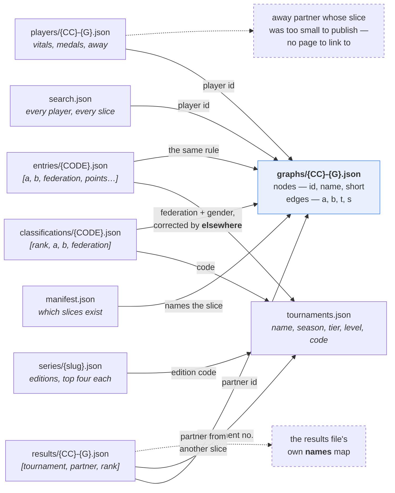

# Data model

The published `/v1/` contract, field by field, and the rules that hold it
together. The authoritative definition is
[`shared/schema.ts`](../shared/schema.ts), shared verbatim by the ingest and
the app; this document explains the *why*.

---

## The tree

```
web/public/v1/                                   measured 17 Sept 2026, 21.7 MB in all
├── manifest.json                   36 KB    index: countries, counts, tiers, freshness
├── tournaments.json               140 KB    every qualifying tournament
├── search.json                    392 KB    every published player, for search
├── graphs/{CC}-{G}.json           5.5 MB    264 files: nodes + edges
├── players/{CC}-{G}.json          2.8 MB    264 files: vitals, medals, foreign partners
├── results/{CC}-{G}.json          2.9 MB    264 files: every tournament every player entered
├── classifications/{CODE}.json    9.3 MB    1,610 files: the full field of one played tournament
├── entries/{CODE}.json             44 KB    6 files: who has entered a tournament still to come
└── series/{slug}.json              52 KB    4 series + index.json: every edition of a recurring event
```

`{CC}` is a **FIVB federation code** (BRA, USA, GER, ENG) — *not* an ISO
country code. `{G}` is `M` or `W`. `{CODE}` is FIVB's own tournament code
(`MPAR2024`), the same value `tournaments.json` carries in its fifth slot.

## How the files join

No file repeats what another one holds, so almost everything on screen is a
join. The two dashed edges are the ones that surprise people.



**A name in a tournament's field is sent to a page by a guess with a
correction list.** A classification or entry list names its players itself, so
it can be read alone, but the page each name opens is a slice — and for 99.17%
of the archive's field appearances that slice is the team's own federation plus
the file's gender. `elsewhere` holds the exceptions: a transfer since, the GBR
split into ENG and SCO, or no page at all. `fieldPlayerSlice` in the schema is
the one place that rule lives, for both files.

**A partner is named by the graph, not by the row that references them.** A
result row is three numbers; the partner's name comes from the `nodes` array of
the same slice. That works because a partner is almost always in the slice —
and where they are not, the results file carries a small `names` map for the
overflow. Two lookups, in that order, and no name is stored twice.

**An `away` partner can be real and still unlinkable.** They belong to a
different slice, which may have fewer than two players and therefore not be
published at all. The card shows their name and federation without a link,
rather than pretending the page exists.

## Identity

| Thing | Key | Stable? |
|---|---|---|
| Player | FIVB player number (`172210`) | Yes — the spine of the whole dataset |
| Tournament | FIVB tournament number (`8954`) | Yes, but meaningless outside VIS |
| Tournament, publicly | FIVB **code** (`WBUS2026`) | Yes — the only durable public handle |
| Partnership | canonical pair `min(id):max(id)` | Derived, order-independent |
| Slice | `{federation}-{gender}` | Follows the player's *current* federation |

A player's federation is a **snapshot**. VIS keeps no history, so a transfer
silently rewrites which slice they belong to — and takes their partnerships
with them. This is the single most consequential property of the model; see
the `away` field below.

## manifest.json

The index. Loaded first, on every page.

```json
{
  "generatedAt": "2026-08-17T14:45:35.126Z",
  "sourceVersion": "114096",
  "seasons": { "from": 1987, "to": 2027 },
  "totals": { "tournaments": 1688, "players": 12075, "partnerships": 13931 },
  "tiers": { "FIVB World Tour": 1077, "Beach Pro Tour": 475, "...": 0 },
  "countries": [ { "code": "BRA", "name": "Brazil", "iso2": "BR",
                   "genders": { "M": { "nodes": 234, "edges": 412 } } } ]
}
```

- **`sourceVersion`** is the highest tournament `Version` seen upstream. It
  changes when FIVB edits anything, which makes it a cheap "did the source
  actually change" signal independent of our own timestamp.
- **`tiers`** publishes the filter's own output, so what the tier allowlist
  admitted is auditable from outside the code.
- **`seasons.to` reads 2027 while no 2027 match has been played** — it is
  computed over the qualifying tournament set, and FIVB publishes future events
  with entry lists. Quirks §4, §11.
- **`iso2`** is for the flag glyph, and is `null` where FIVB has no usable code.

## graphs/{CC}-{G}.json

The graph itself. Loaded with the page.

```json
{
  "country": "BRA", "countryName": "Brazil", "gender": "M",
  "nodes": [ { "id": 100427, "name": "Emanuel Rego", "short": "Emanuel",
               "tournaments": 255, "first": 1993, "last": 2016 } ],
  "edges": [ { "a": 100427, "b": 100997, "t": 101, "f": 2002, "l": 2016,
               "s": [[2002, 7, 118], [2003, 9, 44]] } ]
}
```

**Node.** `short` is the competition name ("Emanuel", "Alison") — graph labels
of the "Paulo Roberto Moreira da Costa" sort would bury the graph. `tournaments`
is the player's own entry count and drives node size; it is a property of the
player, so it does **not** change when the strength filter hides edges.

**Edge keys are terse** (`a`, `b`, `t`, `f`, `l`, `s`) because edges dominate
file size — roughly a 30% saving for free.

**`s` is the per-season breakdown**, `[season, tournaments, startOffset?]`:

- `t`, `f` and `l` are all derivable from `s` (sum, first, last) and are kept
  anyway — they are what the graph and the partner list read on every render,
  and recomputing them per edge per frame to save bytes is the wrong trade.
- `startOffset` is **days from 1 January of that season** to the pair's *last*
  event in it. An offset rather than a date so it stays two or three digits;
  **signed** because a December event can open the following season, and a
  day-of-year would sort it after January's.
- The *last* event, not the first, because the card lists seasons newest-first
  and the rows inside one must run the same way.
- Ordering by this rather than by volume changed which name came first in **38%
  of the ~5,900 seasons in which a player had more than one partner** — a
  one-off fill-in routinely outranked the partner somebody actually switched
  to. (The 38% was measured when the change was made; the population it was
  measured over grows a little every day.)
- Optional, because slices published before the field existed do not carry it;
  the timeline hides itself rather than rendering empty.

**Sorting is by `id`, an immutable key** — not by tournament count. The files
are committed, and sorting by a mutable field would make one player entering
one more tournament reorder the whole array, turning a one-line change into a
full-file diff.

## players/{CC}-{G}.json

Per-player detail. Loaded with the graph, so opening a card costs no request.

```json
{ "id": 104073, "name": "Pedro Solberg", "dob": "1986-03-27",
  "height": 194, "weight": 83,
  "olympics": { "gold": 1, "silver": 1, "bronze": 1 },
  "worldChamps": { "gold": 3, "silver": 0, "bronze": 0 },
  "tour": { "gold": 73, "silver": 36, "bronze": 40 },
  "away": [ { "id": 104505, "name": "…", "fed": "ITA", "gender": "W",
              "t": 8, "f": 2002, "l": 2003 } ] }
```

**Three medal tallies, never merged.** Olympics and World Championships are read
off the raw VIS `Type` (5 and 4) narrowly, so a tier gaining a member cannot
start minting Olympic medals. `tour` is everything else on the FIVB tour —
World Tour plus Beach Pro Tour, 1,552 of 1,688 events — with levels mixed,
because FIVB has renumbered its own hierarchy repeatedly and no mapping across
those eras survives the archive. Age-group championships are in none of the
three. Each is broken out by colour rather than totalled: a total says 149 and
loses that 73 of them were wins.

All four fields are **omitted rather than zeroed** for the majority who have
none.

**`away` is the answer to the slicing trade-off.** A partnership whose halves
sit in different slices has no edge in *either* country's graph. 156 published players
have one; **49 have no partner in their own federation at all** and would
otherwise render as a lone dot with an empty card. Carrying them on the player
shows the career without inventing a cross-country edge the slicing
deliberately excludes.

## tournaments.json

One shared index rather than a copy inside each slice — the names are the same
everywhere, and 264 slices each carrying their own subset would repeat most of
this file hundreds of times in a committed tree.

```json
"8954": ["BPT Futures Busan", 2026, "beach-pro-tour", 225, "WBUS2026", "Futures"]
//        name                season tier             offset code       level
```

**`code` is FIVB's own identifier** — gender letter, venue, year. Populated on
all 1,688 tournaments, no duplicates. It is published because it is the only
stable public handle on a tournament: FIVB retired its per-tournament pages,
the Volleyball World replacement uses hand-curated slugs that cannot be
derived, and VIS itself carries no URL (`WebSite` and `BuyTicketsUrl` are empty
on every record). Nothing renders it — it exists so this data can be joined to
another source, and so a link is one line the day a durable target appears.

**The code's year and the `season` beside it agree on all but six.** They used
to differ on 29: the four Rio de Janeiro events coded `MRIO1988` through
`MRIO1991` all published as season 1987, because VIS gives those rows a `Season`
of `"1987-91"` — a *range*, not a year. `seasonFor` now dates a ranged season by
`StartDateMainDraw`, so 25 of them line up. The six that remain are three
genuinely mis-coded events, the two Tokyo rows named for 2020 and played in
2021, and one January event whose code names the season it opened. Quirks §19 —
so the two fields are close to interchangeable and still must not be joined as
if they were.

**`level` is what FIVB called the event's rung at the time** — "Grand Slam",
"4-star", "Elite16". Present on the 1,552 tour events, absent on the Olympics,
the World Championships and the age-group championships, which have no level
below their tier. It is what lets the player card badge an ordinary week on
tour: `tier` collapses thirteen distinct rungs into one `world-tour` value, so
a 2005 Grand Slam and a 2019 1-star were indistinguishable before it.

It is a **label, not a rank**. FIVB renumbered the hierarchy twice —
Open/Challenger/Satellite, then 1-to-5-star, then Elite16/Challenge/Futures —
and no mapping across those eras survives, so nothing may order one against
another. The names come from
[FIVB's own enum](https://www.fivb.org/VisSDK/VisWebService/BeachTournamentType.html)
rather than from tournament names, which is how `Type` 38 spent months
mislabelled "Major" here when it is `WorldTour5Star`.

**The tuple was appended to, never reordered.** Indices 0–3 keep their meaning,
so this stayed additive to a published contract — twice now, `code` then
`level`. One consequence: the five-element form makes an *explicit null* offset
representable where the slot used to be absent, and a reader that treats null as 0 would date every undated
tournament to 1 January.

## results/{CC}-{G}.json

Every tournament every player in the slice entered. **Lazy** — fetched only when
a reader expands a season on a card.

```json
{ "country": "AUS", "gender": "W",
  "names": { "104138": "Oliver Schmäschke" },
  "players": { "172210": [[8954, 189499, 3], [9138, 189499, 9]] } }
//                         tournament partner rank
```

127,899 rows across the archive — an order of magnitude more than everything
else about a player put together, which is why it is a separate file and a
separate fetch.

**The rows carry no names.** Tournaments are named once in `tournaments.json`;
partners are named by the slice's own graph; only partners from *outside* the
slice appear in `names`.

**`rank` is FIVB's placement, and it is shared rather than unique** — 89% of
played rows sit on a rank another team also holds, because beach volleyball
reports brackets (9th covers 9th–16th). Negative values are eliminations before
the main draw: `<= -25` in qualification, `-2` on a confederation quota.

**On disk, one player per line.** `JSON.stringify(x, null, 2)` would give each
of those 127,899 tuples five lines — roughly 640,000 lines to express 127,899
facts, in a tree that is committed. Keying by line puts the diff boundary where
change actually happens.

## search.json

Every published player, grouped by slice. **Lazy** — fetched on first
interaction with the search box, never with the page.

```json
{ "slices": { "BRA-M": [[100427, "Emanuel Rego", 255]] } }
```

Grouped rather than flat so the slice key is not repeated on 12,074 rows.
Sorted most-tournaments-first, which is the order the search ranks by anyway.

It exists so the box can find a player without the reader knowing their
federation — which is the normal case, and for anyone who transferred the
federation you remember is the wrong answer.

## classifications/{CODE}.json

The full final classification of one played tournament: every team, whatever
federation it came from. **Lazy** — fetched when a reader opens a tournament,
from a season row on a card or from the tournament's own page.

```json
{ "code": "MPAR2024", "gender": "M",
  "teams": [ [1, 143685, 143686, "SWE"], [2, 100427, 104073, "GER"], [3, …] ],
  "players": { "143685": "David Åhman", "143686": "Jonatan Hellvig" },
  "elsewhere": { "104073": "BRA-M" } }
//  rank  a       b       team federation
```

**One small file per tournament, not one per season or one for all.** The
panel that reads it opens for a single event, so the fetch should be that event
and nothing else: measured over the archive a file averages 3.9 KB and the
largest is 10.5 KB, against 146 KB for an average season and 9.3 MB for the
lot. 1,610 of the 1,688 tournaments have one; the other 78 are listed in
`manifest.withoutField`, and that list is exactly the set of tournaments with
no file, because it is what tells the site which tournaments have a page.

**The federation is the team's, taken from its own row, never a player's.**
A player's record holds their federation *today*; a classification is a
historical document. Reading the flag off the player would show Taiana Lima
under Azerbaijan at a 2010 event she played for Brazil, and would silently
rewrite the flags of every athlete who has ever transferred.

**Self-contained, and that is what `players` is for.** The obvious saving is to
drop the names and look them up in `search.json`, which already holds every
player — but that file is 392 KB and is deliberately not fetched until somebody
uses the search box. Depending on it here would mean pulling 392 KB to read a
2 KB classification. The file carries no name, season or date for the
tournament itself: `tournaments.json` has them and is already loaded by anything
that can open this.

**`gender` is stored, not read off the code.** The code usually opens with the
gender letter — `WBUS2026` — and on two tournaments it does not: `Rio2016W`
carries it at the end, and `WWRS2022` is a men's field under a `W`. Quirks §23.

**`elsewhere` is the correction list** described under the join diagram: 1,066
of 128,118 field appearances, 30 KB across the archive against the 1.3 MB of
storing every player's slice. `null` here means a player whose slice held too
few players to publish — one player in the whole archive. 496 files carry the
field; the largest has eight entries.

**Sorted by placement, then eliminations, then the pair's own ids**, so a
rebuild that holds the same result rewrites nothing. `rank` is shared, not
unique — see `results/` above — so a tournament's teams arrive grouped by
placement.

## entries/{CODE}.json

Who has entered a tournament that has no result yet: one still to come, or
played so recently that FIVB has not written placements. **Lazy**, read by the
tournament's page. A tournament has a classification *or* an entry list, never
both, and a cancellation from 2004 gets neither.

```json
{ "code": "MALN2026", "gender": "M",
  "teams": [ [167130, 199950, "INA", 1660, 2492], [179503, 204533, "TUR", 690, 1411, "WC"] ],
  "withdrawn": [ [190604, 190602, "SWE", 690, 1326, "medical"] ],
  "players": { "167130": "…" },
  "elsewhere": { "204533": null } }
//  a       b       fed    entry tech  route / reason
```

**`entry` and `tech` are FIVB's entry and technical points, frozen at the
registration deadline.** A player's own page shows live points and the two
differ by every result since. Null where FIVB publishes none, which happens for
a pair who have never scored. Entry points decide who gets in and technical
points break their ties, which is the order the file is in — confirmed against
FIVB's own list, where Schinko's 788 technical points beat Saucedo's 744 on an
equal 464 entry points.

**`route` is how a team got in when not by ranking**, decoded from
`BeachTeam.Type` against FIVB's published entry lists: `WC` wild card, `QWC`
qualification wild card, `CS` continental slot, `OV` open vacancy. The ordinary
route carries no label, which is why the slot is absent on most rows.

**`withdrawn` is kept rather than dropped** because an entry list a week out is
read to see who is coming, and "was coming, is not" is part of that answer.
The reason is `BeachTeam.Status` decoded — `withdrawn`, `medical`, `late` —
each matched against FIVB's own list for one event. Status 1, an entry
superseded by a later one, is published nowhere, including by FIVB. Quirks §26.
Absent when nobody withdrew.

**Written even when nobody has entered.** The 2027 World Championships had zero
entries a year out, and an empty file is what lets its page say "no entries
yet" instead of failing to load. Six files today, 174 teams in and 68
withdrawn; the count moves with the calendar.

**`null` in `elsewhere` means something different here.** On a classification
it is a player with no published page. On an entry list it is a player with no
international result this site counts *yet* — 59 of 491 current entrants when
measured — and says nothing about whether they have a career: fourteen of Oguz
Degirmenci's twenty tournaments are Turkish National Tour events, a tier this
site excludes on purpose. These are the names that link to FIVB's profile
rather than to a card.

## series/{slug}.json and series/index.json

A recurring event and every edition of it, with the first four placements of
each. **Lazy**, in two steps: a tournament page fetches the index, learns it is
a Gstaad, and fetches only that series. The 87% of tournaments in no series at
all pay for the index and stop there.

```json
// series/index.json
{ "of": { "MGST2026": ["gstaad"], "MPAR2024": ["olympics"] } }

// series/gstaad.json
{ "slug": "gstaad", "name": "Gstaad", "blurb": "The Swiss stop, …",
  "editions": [ { "code": "MGST2026", "season": 2026, "gender": "M",
                  "slug": "bpt-elite-gstaad-2026-men", "name": "BPT Elite Gstaad",
                  "top": [[1, "Alexander Brouwer / Stefan Boermans", "NED"], …] } ] }
```

**Series membership is not something VIS publishes.** There is no series id and
no parent record, and the code is not a reliable handle: `?RIO` is not a Rio de
Janeiro marker, because FIVB reused the stem for Salvador, Itapema and
Uberlândia once the original run ended. `ingest/series.ts` defines membership,
**deriving it where the data supports it and enumerating it where it does
not**, never guessing from a name. Four series today: the Olympic Games (16
editions), the World Championships (30), Gstaad (51) and the Rio de Janeiro
event of 1987–98 (17); 112 tournaments in all.

**The top four are precomputed** because a Gstaad page listing 51 editions
would otherwise fetch 51 classification files to find four rows in each. "Four
placements" is more than four teams whenever a rank is shared — and it usually
is.

**Editions are newest first, men's draw before women's**, the order the two are
named in everywhere else on the site. Each carries its own `slug` and `name`,
because an edition's page is addressed by them and both change across a long
series ("Gstaad Open", "BPT Elite16 Gstaad").

Not here yet: the age-group championships, which are one tier in the published
data but five competitions, and only 70 of the 86 carry the category in their
code. They stay unserialised until VIS's `Type` is published.

## Invariants

Things that are true, and that tests assert against the published files:

1. Every node id in `edges` exists in `nodes` of the same file.
2. A slice has **at least 2 nodes** — smaller ones are not published at all,
   which is why an `away` partner can be real but unlinkable.
3. `tournaments` on a node equals the number of distinct tournaments that
   player entered — the invariant that surfaced the `Rank` 0 double-count.
4. Every tournament referenced by `results` exists in `tournaments.json`.
5. Both halves of a partnership carry the same `t`, `f`, `l`.
6. Every player in `search.json` is a node in their slice's graph.
7. Every player a classification or entry list names has a name in its own
   `players` map, and `fieldPlayerSlice` sends each one to the slice
   `search.json` publishes them in, or to `null` when there is none — asserted
   across all 1,610 classifications against an index built by a different route
   through the ingest.
8. A tournament has a classification or an entry list, never both, and
   `manifest.withoutField` is exactly the set of tournaments with no
   classification file.
9. Every edition in a series file has a classification file of the same code,
   and every code in `series/index.json` names a series file that lists it.

## Changing the contract

**Additive is free**: append a tuple element, add an optional object field.
Existing consumers keep working.

**Reordering or removing is not.** `llms.txt` and the README both publish this
as a stable interface. A break means writing `/v2/` and cutting the frontend
over — no coordinated deploy, since both versions can sit side by side.

When adding a field, the checklist is: `schema.ts` → the ingest that fills it →
the reader → `README.md`'s contract section → the `llms.txt` block in
`prerender.ts` → a test that reads it from the published file.
