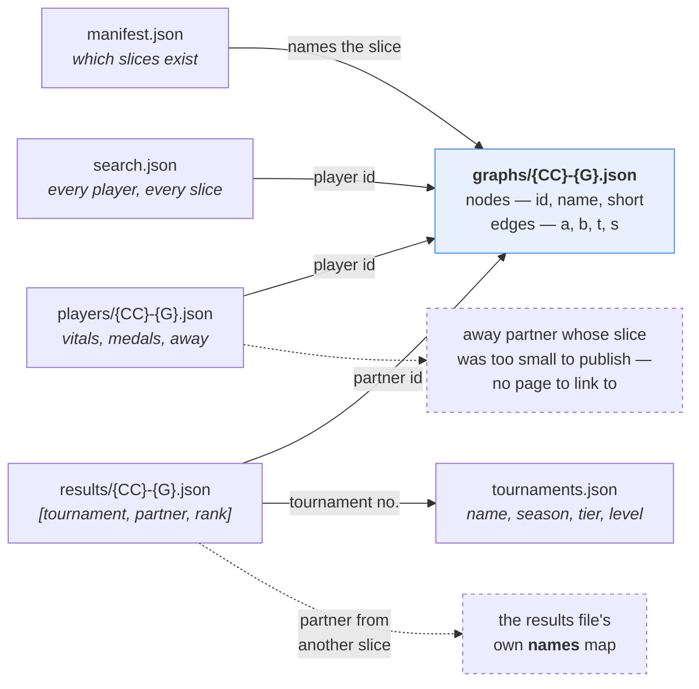

# Data model

The published `/v1/` contract, field by field, and the rules that hold it
together. The authoritative definition is
[`web/src/schema.ts`](../web/src/schema.ts), shared verbatim by the ingest and
the app; this document explains the *why*.

---

## The tree

```
web/public/v1/
├── manifest.json              36 KB    index: countries, counts, tiers, freshness
├── tournaments.json          120 KB    every qualifying tournament
├── search.json               392 KB    every published player, for search
├── graphs/{CC}-{G}.json      5.5 MB    264 files: nodes + edges
├── players/{CC}-{G}.json     2.9 MB    264 files: vitals, medals, foreign partners
└── results/{CC}-{G}.json     2.9 MB    264 files: every tournament every player entered
```

`{CC}` is a **FIVB federation code** (BRA, USA, GER, ENG) — *not* an ISO
country code. `{G}` is `M` or `W`.

## How the files join

No file repeats what another one holds, so almost everything on screen is a
join. The two dashed edges are the ones that surprise people.



**A partner is named by the graph, not by the row that references them.** A
result row is three numbers; the partner's name comes from the `nodes` array of
the same slice. That works because a partner is almost always in the slice —
and where they are not, the results file carries a small `names` map for the
overflow. Two lookups, in that order, and no name is stored twice.

**An `away` partner can be real and still unlinkable.** They belong to a
different slice, which may have fewer than two players and therefore not be
published at all. The card shows their name and federation without a link,
rather than pretending the page exists.

## Identity

| Thing | Key | Stable? |
|---|---|---|
| Player | FIVB player number (`172210`) | Yes — the spine of the whole dataset |
| Tournament | FIVB tournament number (`8954`) | Yes, but meaningless outside VIS |
| Tournament, publicly | FIVB **code** (`WBUS2026`) | Yes — the only durable public handle |
| Partnership | canonical pair `min(id):max(id)` | Derived, order-independent |
| Slice | `{federation}-{gender}` | Follows the player's *current* federation |

A player's federation is a **snapshot**. VIS keeps no history, so a transfer
silently rewrites which slice they belong to — and takes their partnerships
with them. This is the single most consequential property of the model; see
the `away` field below.

## manifest.json

The index. Loaded first, on every page.

```json
{
  "generatedAt": "2026-08-17T14:45:35.126Z",
  "sourceVersion": "114096",
  "seasons": { "from": 1987, "to": 2027 },
  "totals": { "tournaments": 1688, "players": 12075, "partnerships": 13931 },
  "tiers": { "FIVB World Tour": 1077, "Beach Pro Tour": 475, "...": 0 },
  "countries": [ { "code": "BRA", "name": "Brazil", "iso2": "BR",
                   "genders": { "M": { "nodes": 234, "edges": 412 } } } ]
}
```

- **`sourceVersion`** is the highest tournament `Version` seen upstream. It
  changes when FIVB edits anything, which makes it a cheap "did the source
  actually change" signal independent of our own timestamp.
- **`tiers`** publishes the filter's own output, so what the tier allowlist
  admitted is auditable from outside the code.
- **`seasons.to` reads 2027 while no 2027 match has been played** — it is
  computed over the qualifying tournament set, and FIVB publishes future events
  with entry lists. Quirks §4, §11.
- **`iso2`** is for the flag glyph, and is `null` where FIVB has no usable code.

## graphs/{CC}-{G}.json

The graph itself. Loaded with the page.

```json
{
  "country": "BRA", "countryName": "Brazil", "gender": "M",
  "nodes": [ { "id": 100427, "name": "Emanuel Rego", "short": "Emanuel",
               "tournaments": 255, "first": 1993, "last": 2016 } ],
  "edges": [ { "a": 100427, "b": 100997, "t": 101, "f": 2002, "l": 2016,
               "s": [[2002, 7, 118], [2003, 9, 44]] } ]
}
```

**Node.** `short` is the competition name ("Emanuel", "Alison") — graph labels
of the "Paulo Roberto Moreira da Costa" sort would bury the graph. `tournaments`
is the player's own entry count and drives node size; it is a property of the
player, so it does **not** change when the strength filter hides edges.

**Edge keys are terse** (`a`, `b`, `t`, `f`, `l`, `s`) because edges dominate
file size — roughly a 30% saving for free.

**`s` is the per-season breakdown**, `[season, tournaments, startOffset?]`:

- `t`, `f` and `l` are all derivable from `s` (sum, first, last) and are kept
  anyway — they are what the graph and the partner list read on every render,
  and recomputing them per edge per frame to save bytes is the wrong trade.
- `startOffset` is **days from 1 January of that season** to the pair's *last*
  event in it. An offset rather than a date so it stays two or three digits;
  **signed** because a December event can open the following season, and a
  day-of-year would sort it after January's.
- The *last* event, not the first, because the card lists seasons newest-first
  and the rows inside one must run the same way.
- Ordering by this rather than by volume changed which name came first in **38%
  of the ~5,900 seasons in which a player had more than one partner** — a
  one-off fill-in routinely outranked the partner somebody actually switched
  to. (The 38% was measured when the change was made; the population it was
  measured over grows a little every week.)
- Optional, because slices published before the field existed do not carry it;
  the timeline hides itself rather than rendering empty.

**Sorting is by `id`, an immutable key** — not by tournament count. The files
are committed, and sorting by a mutable field would make one player entering
one more tournament reorder the whole array, turning a one-line change into a
full-file diff.

## players/{CC}-{G}.json

Per-player detail. Loaded with the graph, so opening a card costs no request.

```json
{ "id": 104073, "name": "Pedro Solberg", "dob": "1986-03-27",
  "height": 194, "weight": 83,
  "olympics": { "gold": 1, "silver": 1, "bronze": 1 },
  "worldChamps": { "gold": 3, "silver": 0, "bronze": 0 },
  "tour": { "gold": 73, "silver": 36, "bronze": 40 },
  "away": [ { "id": 104505, "name": "…", "fed": "ITA", "gender": "W",
              "t": 8, "f": 2002, "l": 2003 } ] }
```

**Three medal tallies, never merged.** Olympics and World Championships are read
off the raw VIS `Type` (5 and 4) narrowly, so a tier gaining a member cannot
start minting Olympic medals. `tour` is everything else on the FIVB tour —
World Tour plus Beach Pro Tour, 1,552 of 1,688 events — with levels mixed,
because FIVB has renumbered its own hierarchy repeatedly and no mapping across
those eras survives the archive. Age-group championships are in none of the
three. Each is broken out by colour rather than totalled: a total says 149 and
loses that 73 of them were wins.

All four fields are **omitted rather than zeroed** for the majority who have
none.

**`away` is the answer to the slicing trade-off.** A partnership whose halves
sit in different slices has no edge in *either* country's graph. 156 published players
have one; **49 have no partner in their own federation at all** and would
otherwise render as a lone dot with an empty card. Carrying them on the player
shows the career without inventing a cross-country edge the slicing
deliberately excludes.

## tournaments.json

One shared index rather than a copy inside each slice — the names are the same
everywhere, and 264 slices each carrying their own subset would repeat most of
this file hundreds of times in a committed tree.

```json
"8954": ["BPT Futures Busan", 2026, "beach-pro-tour", 225, "WBUS2026", "Futures"]
//        name                season tier             offset code       level
```

**`code` is FIVB's own identifier** — gender letter, venue, year. Populated on
all 1,688 tournaments, no duplicates. It is published because it is the only
stable public handle on a tournament: FIVB retired its per-tournament pages,
the Volleyball World replacement uses hand-curated slugs that cannot be
derived, and VIS itself carries no URL (`WebSite` and `BuyTicketsUrl` are empty
on every record). Nothing renders it — it exists so this data can be joined to
another source, and so a link is one line the day a durable target appears.

**The code's year is not the `season` beside it**, on 29 of the 1,688. The four
Rio de Janeiro events coded `MRIO1988` through `MRIO1991` all publish as season
1987. That is not a coding error: VIS gives those rows a `Season` of `"1987-91"`
— a *range*, not a year — and `parseSeason` keeps the first four digits. The
code carries the year the event was actually played, and on 26 of the 29 it is
the code that matches `StartDateMainDraw`. Quirks §19. Do not join these two
fields expecting them to agree, in either direction.

**`level` is what FIVB called the event's rung at the time** — "Grand Slam",
"4-star", "Elite16". Present on the 1,552 tour events, absent on the Olympics,
the World Championships and the age-group championships, which have no level
below their tier. It is what lets the player card badge an ordinary week on
tour: `tier` collapses thirteen distinct rungs into one `world-tour` value, so
a 2005 Grand Slam and a 2019 1-star were indistinguishable before it.

It is a **label, not a rank**. FIVB renumbered the hierarchy twice —
Open/Challenger/Satellite, then 1-to-5-star, then Elite16/Challenge/Futures —
and no mapping across those eras survives, so nothing may order one against
another. The names come from
[FIVB's own enum](https://www.fivb.org/VisSDK/VisWebService/BeachTournamentType.html)
rather than from tournament names, which is how `Type` 38 spent months
mislabelled "Major" here when it is `WorldTour5Star`.

**The tuple was appended to, never reordered.** Indices 0–3 keep their meaning,
so this stayed additive to a published contract — twice now, `code` then
`level`. One consequence: the five-element form makes an *explicit null* offset
representable where the slot used to be absent, and a reader that treats null as 0 would date every undated
tournament to 1 January.

## results/{CC}-{G}.json

Every tournament every player in the slice entered. **Lazy** — fetched only when
a reader expands a season on a card.

```json
{ "country": "AUS", "gender": "W",
  "names": { "104138": "Oliver Schmäschke" },
  "players": { "172210": [[8954, 189499, 3], [9138, 189499, 9]] } }
//                         tournament partner rank
```

127,899 rows across the archive — an order of magnitude more than everything
else about a player put together, which is why it is a separate file and a
separate fetch.

**The rows carry no names.** Tournaments are named once in `tournaments.json`;
partners are named by the slice's own graph; only partners from *outside* the
slice appear in `names`.

**`rank` is FIVB's placement, and it is shared rather than unique** — 89% of
played rows sit on a rank another team also holds, because beach volleyball
reports brackets (9th covers 9th–16th). Negative values are eliminations before
the main draw: `<= -25` in qualification, `-2` on a confederation quota.

**On disk, one player per line.** `JSON.stringify(x, null, 2)` would give each
of those 127,899 tuples five lines — roughly 640,000 lines to express 127,899
facts, in a tree that is committed. Keying by line puts the diff boundary where
change actually happens.

## search.json

Every published player, grouped by slice. **Lazy** — fetched on first
interaction with the search box, never with the page.

```json
{ "slices": { "BRA-M": [[100427, "Emanuel Rego", 255]] } }
```

Grouped rather than flat so the slice key is not repeated on 12,074 rows.
Sorted most-tournaments-first, which is the order the search ranks by anyway.

It exists so the box can find a player without the reader knowing their
federation — which is the normal case, and for anyone who transferred the
federation you remember is the wrong answer.

## Invariants

Things that are true, and that tests assert against the published files:

1. Every node id in `edges` exists in `nodes` of the same file.
2. A slice has **at least 2 nodes** — smaller ones are not published at all,
   which is why an `away` partner can be real but unlinkable.
3. `tournaments` on a node equals the number of distinct tournaments that
   player entered — the invariant that surfaced the `Rank` 0 double-count.
4. Every tournament referenced by `results` exists in `tournaments.json`.
5. Both halves of a partnership carry the same `t`, `f`, `l`.
6. Every player in `search.json` is a node in their slice's graph.

## Changing the contract

**Additive is free**: append a tuple element, add an optional object field.
Existing consumers keep working.

**Reordering or removing is not.** `llms.txt` and the README both publish this
as a stable interface. A break means writing `/v2/` and cutting the frontend
over — no coordinated deploy, since both versions can sit side by side.

When adding a field, the checklist is: `schema.ts` → the ingest that fills it →
the reader → `README.md`'s contract section → the `llms.txt` block in
`prerender.ts` → a test that reads it from the published file.
