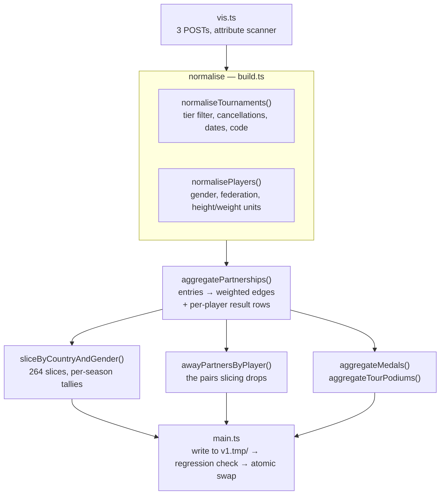

# Implementation guide

What each module does, how to make a common change, and the conventions that
hold. Read [architecture.md](architecture.md) first for the shape;
[data-model.md](data-model.md) for the contract.

---

## Layout

```
ingest/          build-time: fetch, normalise, publish, prerender
web/src/         the app
  lib/           pure helpers, each with a sibling .test.ts
  components/    React components, each with a sibling .css
  graph/         force layout (no React)
  schema.ts      THE CONTRACT — shared by both halves
e2e/             Playwright tests against the built site
.github/         CI, two deploy workflows, three composite actions
docs/            these documents
```

## The ingest

Run with `npm run ingest`. Roughly 15 seconds end to end.



| File | Responsibility |
|---|---|
| `vis.ts` | The only thing that talks to FIVB. POST, retry with backoff, and a hand-rolled attribute scanner instead of an XML parser. Also the unit converters — VIS stores height in ten-thousandths of a metre. |
| `tiers.ts` | What counts as "FIVB international". One allowlist table; everything excluded is listed with a reason. |
| `countries.ts` | Federation code → display name, via `Intl.DisplayNames` rather than a table that would rot. |
| `build.ts` | All the pure logic. No network, no filesystem — which is why the awkward parts are unit-testable. |
| `regression.ts` | Refuses to publish a rebuild that looks like a broken fetch. |
| `olympics.ts`, `worlds.ts` | Season → host for the two championships FIVB names inconsistently. Anything unmapped keeps FIVB's own name. |
| `main.ts` | Orchestration and I/O: fetch, call `build.ts`, write, check, swap. |
| `prerender.ts` | Post-build: 265 static pages, sitemap, robots, llms.txt. |

**Publishing is atomic.** Everything is written to `v1.tmp/`, checked, then
swapped: the previous tree is renamed *aside* before the new one is renamed
*in*, never deleted first. `rm` then `rename` leaves a window where there is no
data at all; interrupt there and you have nothing. `recoverInterruptedSwap()`
handles a process killed inside the rename window on the *next* run, because a
SIGKILL leaves no handler to do it.

## The app

`App.tsx` owns all state — country, gender, selection, threshold — and passes
it down. There is no store and no router.

| File | Responsibility |
|---|---|
| `lib/api.ts` | Six fetches behind a memoising map. A failed fetch is not cached, or a blip would be permanent. |
| `lib/search.ts` | Match and rank. Accent folding, prefix-before-substring, on-screen-before-elsewhere. |
| `lib/timeline.ts` | Regroup a player's partnerships by season. |
| `lib/results.ts` | Turn published result rows into one season's events. |
| `lib/useResults.ts` | The lazy fetch behind season expansion. |
| `lib/format.ts` | Display helpers: dates, medals, ordinals, flags, finishes. |
| `lib/slug.ts` | `/brazil-men/` ↔ slice, shared with the prerenderer so a link can never point at a page the other side would not produce. |
| `graph/layout.ts` | d3-force configuration. Many small components, so the centring forces stop the long tail drifting off-canvas. |
| `components/PartnershipGraph.tsx` | SVG, refs, and the tick loop. The one place that opts out of React re-rendering. |
| `components/PlayerCard.tsx` | The detail panel: vitals, partners, timeline, season expansion, foreign partners. |

## Conventions

These are also encoded as a skill at `.claude/skills/data-conventions/`, which
Claude Code loads automatically when someone works on the ingest, the published
tree, or a test that reads it. The skill carries the runnable version — the
commands for measuring a published field, checking which fields a data diff
touched, and breaking a test to confirm it fails. Change both together.


**Comments carry the reasoning.** This codebase is heavily commented on purpose:
most non-obvious lines encode a decision with a measurement behind it. A
comment saying *what* the code does is noise; one saying *why it is not the
obvious alternative* is the point. When you change the code, change the comment
— a stale one is worse than none.

**Numbers in comments are measured**, not estimated. "89% of played rows", "156
published players have a foreign partner", "49 of them have none at home". If
you cannot measure it, say that instead.

Two kinds of number live in these docs and they age differently. One describes
**the artifact as it stands** — file sizes, row counts, how many tests there
are — and has to be true today; those are the ones that go stale on a weekly
refresh, and the fix is to re-measure. The other records **what an
investigation found** — "38% of shared seasons changed order", "89% of played
rows share a rank" — and is a dated observation that stays as written, unless
re-measuring shows the finding itself no longer holds. Say which you mean when
the population is the sort that grows.

**Tuples where volume justifies them.** `SeasonTally`, `ResultEntry`,
`TournamentMeta` and `SearchEntry` are positional arrays, with named tuple
labels so TypeScript still documents them. Everything else is an object.

**Terse keys only on edges**, where they buy ~30%.

**Omit rather than zero.** `olympics`, `tour`, `away` are absent for players
who have none, which is most of them.

## Testing

Two layers, 580 tests total.

**Unit — 467 tests, `npm test`.** Vitest, sibling `.test.ts` files. Everything
in `build.ts` and `web/src/lib/` is pure, so this is where the logic lives.
Fixtures include real, awkward rows: the 1997 World Championships with two
bronzes, the Olympic qualifier with two winners.

Logic that starts life inside a component gets **lifted into `lib/` to be
tested**, not tested through the DOM: `filter.ts` (the strength threshold) and
`table.ts` (the sort comparator) were both `useMemo` bodies first. The
component keeps the state and the markup; the rule it applies becomes a pure
function with a name.

**Browser — 113 tests, `npm run test:e2e`.** Playwright against `vite preview`
of the real `dist/`, in seven files:

| | |
|---|---|
| `smoke.spec.ts` | does the page render, and does it agree with its data |
| `routing.spec.ts` | deep links, the address bar, the canonical tag |
| `layout.spec.ts` | five viewports; no overflow, no collapsed list |
| `keyboard.spec.ts` | focus contract and the search combobox |
| `table.spec.ts` | sorting: order, `aria-sort`, and the arrow agreeing |
| `filter.spec.ts` | the min-events threshold, across every panel it changes |
| `pointer.spec.ts` | a tap near a node opens it, at the zoom a real slice picks |

The rule that makes these worth having: **every assertion is cross-checked
against the JSON the page was built from**, never against a number typed into
the test. They stay true as the weekly refresh changes the data, and fail
exactly when the page and its data disagree.

Habits worth copying:

- **Find the subject by scanning, not by name.** `strandedPlayer()`,
  `accentedPlayerElsewhere()` and `singleGenderCountry()` search the published
  files for a player or country matching the *shape* the feature is about.
  Hard-coding a name turns a regression test into a test that fails the week
  FIVB updates a federation.
- **Guard the guard.** Assert the fixture is non-trivial before asserting on it
  — otherwise a test passes vacuously when the data it needs disappears.
- **Don't compute the expectation with the code under test.** `table.spec.ts`
  writes its own comparator rather than importing `sortRows`. Sharing it would
  make the test agree with any comparator, including a broken one — verified by
  breaking the real one and watching the test still pass.
- **Verify a regression test by breaking the code.** Every test here was run
  against a deliberately mutated build first — the orphan-drop removed from
  `filterByStrength`, the sort direction inverted, `og:url` left unset, the
  gender fallback deleted — and kept only if it failed. A test that has never
  failed is a test that has never been checked.

**A JS-error guard is automatic.** Any uncaught exception or `console.error`
fails the test at teardown. Most ways a page can break show up as a thrown
error long before a missing element anyone thought to assert on.

*Deliberately not covered:* wheel and pinch gestures. Verifiable by hand but
measurably flaky under CDP — a check that blocks deploys and cries wolf is
worse than no check.

## Recipes

### Add a field to the published data

1. `web/src/schema.ts` — add it, **appending** if it is a tuple.
2. `ingest/build.ts` — compute it in a pure function.
3. `ingest/main.ts` — write it.
4. The reader in `web/src/`.
5. `README.md`'s contract section and the `llms.txt` block in `prerender.ts`.
6. A test that reads it back from the published file.
7. `npm run ingest` and commit the regenerated tree in its **own commit**, so
   the data churn is reviewable apart from the logic.

### Add a view to the player card

The card is already dense and height-constrained. Before adding, read the
`.partners` and `.partners ul` comments in `PlayerCard.css` — the card is
capped at the graph's height, and the flex minimums there are load-bearing.
Two bugs have come from getting them wrong: a list rendering as literally
nothing at 1280×720, and rows painting straight through the profile link.

If the view needs data not already loaded, follow the `useResults` pattern:
fetch on first interaction, render fine without it, fail silently.

### Change what counts as a tournament

`ingest/tiers.ts`, one table. Add a test pinning the new behaviour, then run the
ingest and expect the regression check to stop you — a deliberate exclusion
change *should* trip it. Re-run with `ALLOW_DATA_REGRESSION` and note the drop
in the commit message.

### Debug a missing player or result

In order:

1. Is the tournament in the qualifying set? (`tiers.ts` — check `Type` and
   `OrganizerType`.)
2. Does the team row have a real `Rank`? Blank or `0` means "never played" and
   is excluded by design. If the event just finished, this is quirks §17 and
   resolves itself — the ingest's `awaiting` line names it.
3. Are both players in the same slice? If not the edge is dropped by design and
   the pair should appear under *Other federations*.
4. Is the player's federation what you expect? It is a *current* snapshot.

## Gotchas

- **Always pass `Fields` to VIS.** Some requests return a silently empty element
  without it — which reads exactly like "no data" and has already produced one
  wrong conclusion.
- **`Number('')` is `0`**, which is why a blank `Rank` correctly falls into the
  never-played branch. Convenient, and worth knowing before you "fix" it.
- **Negative ranks mean different things in different entities.** In
  `BeachTeam.Rank` a negative is a qualification or quota exit. In
  `BeachTournamentRanking` it marks a *shared* placement. Swapping sources
  without translating would read every shared 5th place as an elimination.
- **`web/public/v1/` is generated.** Never hand-edit. If a run touches only
  `manifest.json`'s timestamp, revert it — code-only PRs should not carry data
  churn.
- **A rebase that resolves `manifest.json` by hand leaves the tree
  inconsistent** — half from one fetch, half from another. Re-run the ingest
  after, so the manifest's freshness marker matches the slices it describes.
